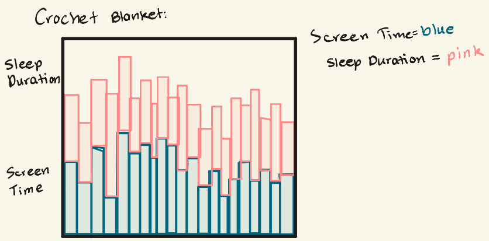
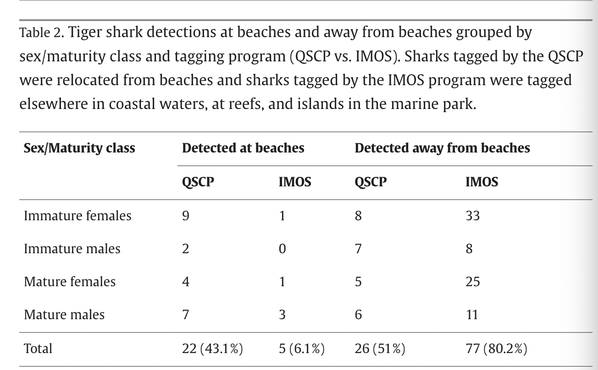
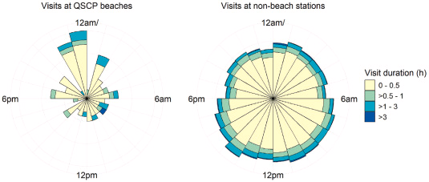
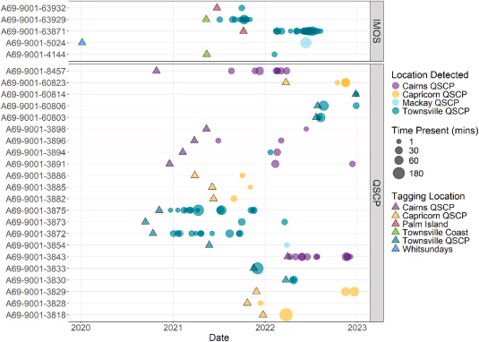

# Part 1. Set up tasks

```{r}
#| label: packages and data
#| message: false
#| warning: false

#read in packages here
library(tidyverse)
library(here)
library(janitor)
library(readxl)
library(ggeffects)
library(readr)

#read in data here
salinity <- pickleweed <- read_csv(here::here("code", "data", "salinity-pickleweed.csv"))
my_data <- read_csv(here::here("code", "data", "pp_new.csv"))
```

# Part 2. Problems

## Problem 1. Slough soil salinity

### a.

To determine the strength of the relationship between salinity (electrical conductivity in mS/cm) and California pickleweed biomass (g), we can run a Pearson’s correlation and a Spearman’s rank correlation. A Pearson’s correlation test allows us to see how two continuous variables are related to each other and what strength (strong, moderate, weak, or none) this relationship is. A Spearman rank correlation measures the strength of a monotonic relationship between variables based on ranked values, this test doesn’t require normality so it stays accurate even with outliers.

### b.

```{r}
#| label: salinity and biomass plot
#| message: false
#| warning: false

#ggplot base 
ggplot(data = salinity, #starting data frame
       aes(x = salinity_mS_cm, #makes x-axis salinity
           y = pickleweed)) + #makes y-axis biomass
  geom_point(color = "deeppink4") + #adds data points in green
  labs(x = "Soil salinity (mS/cm)", #adds label to x-axis
       y = "Pickleweed biomass (g)", #adds label to y-axis
       title = "As soil salinity increases, so does pickleweed biomass") + #adds graph title 
  theme_minimal() #changes graph theme
```

### c.

#### Check assumptions:

```{r}
#| label: checking assumptions
#| message: false
#| warning: false

salinity_model <- lm( #create object to store information
  pickleweed ~ salinity_mS_cm, #formula: response ~ predictor variable
  data = salinity) #data frame used

summary(salinity_model) #display summary

#base R residuals
par(mfrow = c(2, 2)) #create a 2x2 output gride for diagnostic plots
plot(salinity_model) #plot salinity_model information
```

The assumptions I checked for a Pearson correlation model began with a Q-Q Residuals plot assesing normally distributed residuals using QQ plots, here it shows the quantiles following a straight line of the theoretical normal quantiles with only a slight deviation at the end, proving to be normally distributed of residuals. The Residuals vs Fitted plot this checks for homoscedasticity (constant variance) which is proven due to the residuals being somewhat random and evenly spread around the horizontal dotted line, the Scale-Location plot assesses the same but uses the square root of the standardized residuals and this plot also proved there to be constant variance. Lastly in Residuals vs Leverage, this plot determines if there are any outliers influencing the model with Cook's distance, since there aren't any points outside the dotted lines this means there aren't any outliers that would influence the model, which meets all the assumptions for Pearson's correlation.

#### Run test:

```{r}
#| label: run correlation tests
#| message: false
#| warning: false
#run pearson correlation test
cor.test(salinity$pickleweed, salinity$salinity_mS_cm,
         method = "pearson")
```

### d.

To determine the strength of the relationship between pickleweed biomass and soil salinity, I used a Pearson’s correlation test since these two continuous variables are related to each other and I wanted to evluate the strength of this relationship and all the assumptions were met for this test. I found a moderate positive relationship between soil salinity and pickleweed biomass(g) (Pearson's r = 0.53, t(21) = 2.9, p = 0.01, $\alpha$ = 0.05). This indicates that as soil salinity (mS/cm) increases that pickleweed biomass (g) also tends to increase.

### e.

From this test it appears there is some effect of soil salinity on pickleweed biomass. As soil salinity increases, so does pickleweed biomass. To have successful pickleweed plants at this restoration site, we should test the soil's salinity along different points of the brackish slough to see where the higher areas of salinity are to plant pickleweed by the salt water.

### f.

```{r}
#| label: spearman's rank test
#| message: false
#| warning: false
#run spearman correlation test
cor.test(salinity$pickleweed, salinity$salinity_mS_cm,
         method = "spearman")
```

I found a moderate positive relationship between soil salinity and pickleweed biomass(g) (Spearman ρ = 0.59, S = 824, p = 0.003, $\alpha$ = 0.05).

Both a Pearson’s correlation and a Spearman’s rank correlation led me to conclude the same results about there being a moderate positive relationship of soil salinity on pickleweed biomass (g). In the Spearman's rank correlation this compares the variable using their ranked values, since the correlation coefficient (ρ = 0.59) this shows a moderate positive relationship and since the p-value (0.003) is less than 0.05 it shows results are statistically significant and we can reject the null hypothesis that there is no association between salinity and biomass. For Pearson's correlation, the correlation coefficient (r = 0.53) also shows a moderate positive linear relationship between soil salinity and pickleweed biomass, the p-value (0.01) which is below 0.05 also meaning it is a statistically significant result and we can reject the null hypothesis.

## Problem 2. Personal data

### a.

Cleaning and wrangling data:

```{r}
#| label: clean my data
my_data_clean <- my_data |> #create new object for cleaned personal data
  rename(date = "Date (mm/dd/yyyy)", #renames column 'date'
         day = "Day of Week", #renames colum 'day'
         sleep_duration = "Sleep Duration (minutes)", #renames column 'sleep_duration'
         step_count = "Step Count", #renames colum 'step_count'
         homework_duration = "Time spent on homework (minutes)", #renames column 'homework_duration'
         screen_time = "Screen Time (minutes)", #renames column 'screen_time'
         exercise_duration = "Exercise duration (minutes)", #renames_column 'exercise_duration'
         caffeine_intake = "Caffeine Intake (mg)") #renames column 'caffeine_intake' 
```

Graph with a categorical predictor:

```{r}
#| label: graph of my data with categorical predictor
order <- c("Monday", "Tuesday", "Wednesday", "Thursday", "Friday") #defines the order of weekdays 

ggplot(data = my_data_clean, #start with my_data_clean data frame 
       aes(x = factor(day, level = order), #x-axis should be day of the week but converted in order of weekday 
           y = sleep_duration, #y-axis should be sleep duration in minutes
           fill = factor(day, level = order))) + #fills in the boxes by day of week
  geom_boxplot() + #first layer is a boxplot
  geom_jitter(width = 0.2, #makes the points jitter horizontally 
              height = 0) + #makes the points not jitter horizontally 
         labs(x = "Day of Week", #adds x-axis title
              y = "Sleep Duration (minutes)", #adds y-axis title 
              title = "Distribution of Sleep Duration by Day of the Week", #adds graph title 
              subtitle = "Most recent observation: 03/05/2026",
              fill = "Day of Week") + #adds legend title 
  scale_fill_manual(values = c( #changes the color of each group
      "Monday" = "lightgoldenrod", #changes Monday data color
      "Tuesday" = "lightpink2",  #changes Tuesday data color
      "Wednesday" = "lightsalmon3", #changes Wednesday data color
      "Thursday" = "lightskyblue3", #changes Thurday data color 
      "Friday" = "mediumorchid4")) + #changes Friday data color 
  theme_minimal() + #changes theme of graph 
  theme(legend.position = "none") #removes legend

```

Graph with a continuous predictor:

```{r}
#| label: graph of my data with continuous predictor
#base layer: ggplot call 
ggplot(data = my_data_clean, #start with data frame 'my_data_clean'
       aes(x = screen_time, #x-axis is data of 'screen_time'
           y = sleep_duration)) + #y-axis is data of 'sleep_duration'
  geom_point(color = "purple4", shape = 18, size = 3, na.rm = TRUE) + #changes the point color, shape, and size 
  labs(x = "Screen Time (minutes)", #adds x-axis title
       y = "Sleep Duration (minutes)", #adds y-axis title 
       title = "How Screen Time affects Sleep Duration", 
       subtitle = "Most recent observation: 03/05/2026") + #adds a graph title 
  theme_minimal() #changes graph theme 
```

### b.

**Figure 1. Distribution of sleep duration (minutes) across different days of the week.** The black circles represent my indivudal observations of sleep duration, categorized by the day of the school week (Monday, Tuesday, Wednesday, Thursday, and Friday). Each day of the week is associated with its own color and has a box plot with my sleep data. The middle line in each box plot represents the median and the outer lines represent the first and third quartile. Sleep duration appears the most variable and longest on Monday and Wednesday, while Tuesday appears to have the least variation and shortest duration. (ADD DATA SOURCE??)

**Figure 2. Relationshiip between daily screen time (minutes) and sleep duration (minutes).** The scatter plot graphs the relationship between daily screen time and sleep duration that night in minutes. Each purple diamond represents an observation. Screen time is on the x-axis in minutes and sleep duration is on the y-axis in minutes. The data shows the variation in sleep duration across different levels of screen time.

## Problem 3. Affective visualization

### a.

For my personal project that analyzes screen time and sleep duration, I could crochet a small "blanket" to visually show how my habits shift over the course of this quarter. Each day would have its own vertical column and I would use a dark colored yarn to represent my daily screen time. This means if it was higher on a day the yarn would take up more of the vertical column and if my daily screen time was lower than there would be less of the yarn. Then my sleep duration would be in a lighter color that follows the same concept and to make the blanket an even square I would use either white or black to fill in any gaps. This would create a pattern to show whether high screen time clusters with more or less sleep in a visual way that is easy to interpret and meaningful.

### b.



### c. 

(insert draft)

### d.

-   This piece is showing how daily screen time (minutes) affects sleep duration (minutes).

-   My influences from this work drew from Lorraine Woodruff-Long’s warming strips quilt with how she shows different temperature changes with different colors. I really liked how this piece drew a lot of emotion from me when I first viewed it and I hope to do the same with my visualization.

-   My work is a crocheted blanket with vertical dark green columns representing screen time for each day, then the light green yarn on top of those columns will represent the sleep duration. The longer the piece of yarn is, the longer the screen time or sleep duration is.

-   My process in this is to have columns to represent each day, then using dark green yarn this will represent my screen time. The longer the strip of yarn, the higher the screen time was for that day, then on top of that will be a strip of light green yarn to represent sleep duration with the same concept. Overall this will show how each length of screen time and the sleep duration that day in a visual way that is easy to understand.

### e.

[View](https://docs.google.com/presentation/d/1JEtQglbbgKO6vpzyjNLza9CP3tumNa0XM9l72nyFruo/edit?usp=sharing)

## Problem 4. Statistical critique

#### a.

The authors are investigating if relocating tiger sharks found on beaches will revisit beaches more than sharks found at other locations in the marine park. The statistical test used is a Generalized Linear Model with a binomial distribution. The response variable is the movement of tiger sharks once tagged to beaches or elsewhere and the predictor variable is the tagging location of sharks, either found at beaches or farther away in the Marine Park.



The authors wrote about the results saying the "Probability of visiting beaches was greater for tiger sharks relocated from beaches than for sharks tagged elsewhere (*X^2^* = 33.66, *df* = 1, *p* \< 0.001). However, there was no effect of sex and maturity on presence at beaches (*X^2^* = 3.99, df = 3, p = 0.26). Once at beaches, weighted residency indices did not differ (Wilcoxon rank sum test, p = 0.697, W = 70) between sharks relocated from beaches (I~WR~ median and interquartile range: 0.002, 0.004) and those tagged elsewhere (I~WR~ median and interquartile range: 0.002, 0.002)."

### b.



This figure is shown in the paper and the authors visually represented the patterns in tiger shark visits at QSCP beaches versus non-beach stations with circular bar plots. There is a time axis that aligns with a clock around the circle (12am, 6am, 12pm, and 6pm) which I think easily allows readers to interpret this figure. Additionally the different colors represent the duration of sharks at these beaches, the light yellow representing a short visit (0-0.5 hours) while dark blue represents longer visits (\> 3 hours). Although this figure doesn't show any statistics, it mainly just visualizes the patterns of these sharks in way that references a clock and is easy to interpret.

### c.



This figure handles both visual clutter and the ink to data well. This is because most of the ink in the graphic is to represent a point and different shapes/colors are used to represent different data so there isn't any unnecessary design elements. Additionally there aren't too many grid lines so it is visually easy to read and creates no visual clutter there. Overall this figure is easy to read with little visual clutter and not too many elements to make it confusing to interpret.

### d.
